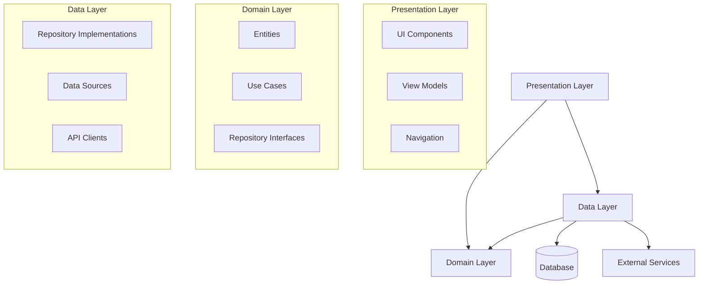
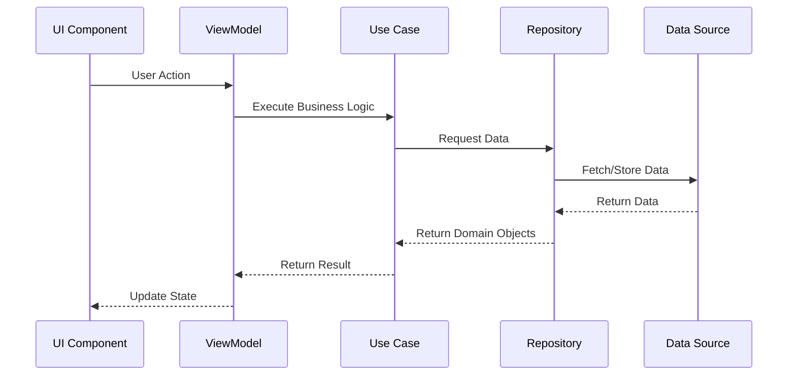
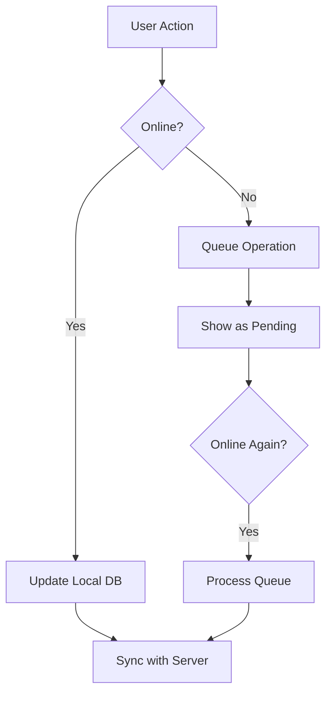

# Visão Geral da Arquitetura

## Introdução

O Osiris Rise é construído seguindo os princípios da Clean Architecture, garantindo separação de responsabilidades, testabilidade e manutenibilidade. A arquitetura foi projetada para suportar o crescimento do aplicativo e facilitar a adição de novas funcionalidades.

## Diagrama de Arquitetura



## Camadas da Arquitetura

### Presentation Layer (UI)

A camada de apresentação é responsável pela interface do usuário e interações.

**Componentes principais:**
- **UI Components**: Elementos visuais e interativos
- **View Models**: Gerenciam o estado da UI e processam eventos
- **Navigation**: Controla o fluxo entre telas

**Tecnologias:**
- Flutter para desenvolvimento cross-platform
- Provider para gerenciamento de estado
- Material Design para UI consistente

### Domain Layer (Business Logic)

A camada de domínio contém as regras de negócio e lógica central do aplicativo.

**Componentes principais:**
- **Entities**: Modelos de dados do domínio
- **Use Cases**: Implementam a lógica de negócio
- **Repository Interfaces**: Definem contratos para acesso a dados

**Características:**
- Independente de frameworks
- Altamente testável
- Contém as regras de negócio centrais

### Data Layer (Data Access)

A camada de dados gerencia o acesso a fontes de dados externas e internas.

**Componentes principais:**
- **Repository Implementations**: Implementam interfaces do domínio
- **Data Sources**: Acessam fontes de dados específicas
- **API Clients**: Comunicam-se com serviços externos
- **DTO (Data Transfer Objects)**: Mapeiam dados entre camadas

**Tecnologias:**
- Firebase para backend (Firestore, Authentication)
- SQLite para armazenamento local
- Retrofit para chamadas de API REST

## Fluxo de Dados



## Padrões de Design

### Dependency Injection
Utilizamos injeção de dependência para desacoplar componentes e facilitar testes.

```dart
// Exemplo simplificado
final serviceLocator = GetIt.instance;

void setupDependencies() {
  // Repositories
  serviceLocator.registerLazySingleton<UserRepository>(
    () => UserRepositoryImpl(serviceLocator())
  );
  
  // Use Cases
  serviceLocator.registerLazySingleton(
    () => GetUserProfile(serviceLocator())
  );
  
  // ViewModels
  serviceLocator.registerFactory(
    () => ProfileViewModel(serviceLocator())
  );
}
```

### Repository Pattern
Abstraímos o acesso a dados através de repositórios, permitindo múltiplas fontes de dados.

```dart
// Interface no Domain Layer
abstract class HabitRepository {
  Future<List<Habit>> getHabits();
  Future<void> saveHabit(Habit habit);
  Future<void> completeHabit(String id, DateTime date);
}

// Implementação no Data Layer
class HabitRepositoryImpl implements HabitRepository {
  final HabitDataSource localDataSource;
  final HabitDataSource remoteDataSource;
  
  HabitRepositoryImpl(this.localDataSource, this.remoteDataSource);
  
  @override
  Future<List<Habit>> getHabits() async {
    // Implementação com cache e sincronização
  }
  
  // Outras implementações...
}
```

### Observer Pattern
Utilizamos o padrão Observer para notificações e atualizações reativas.

## Estratégia de Offline-First

O Osiris Rise implementa uma estratégia offline-first, permitindo que os usuários utilizem o aplicativo mesmo sem conexão com a internet.



## Segurança

- **Autenticação**: Firebase Authentication com múltiplos provedores
- **Autorização**: Regras de segurança no Firestore
- **Armazenamento de Dados Sensíveis**: Flutter Secure Storage
- **Criptografia**: Dados sensíveis criptografados em repouso e em trânsito

## Escalabilidade

A arquitetura foi projetada para escalar horizontalmente:

- **Microserviços**: Backend dividido em serviços especializados
- **Caching**: Estratégias de cache em múltiplos níveis
- **Sharding**: Particionamento de dados para distribuição de carga
- **CDN**: Distribuição de conteúdo estático via CDN

## Monitoramento e Analytics

- **Firebase Crashlytics**: Rastreamento de crashes
- **Firebase Performance**: Monitoramento de performance
- **Custom Analytics**: Eventos personalizados para análise de uso
- **Logging**: Sistema de logs estruturados para debugging

## Próximos Passos

- [Modelo de Dados](data-model.md) - Entenda as entidades e relacionamentos
- [Autenticação](authentication.md) - Explore o sistema de autenticação
- [Contador de Recaídas](relapse-counter.md) - Veja como implementamos esta funcionalidade