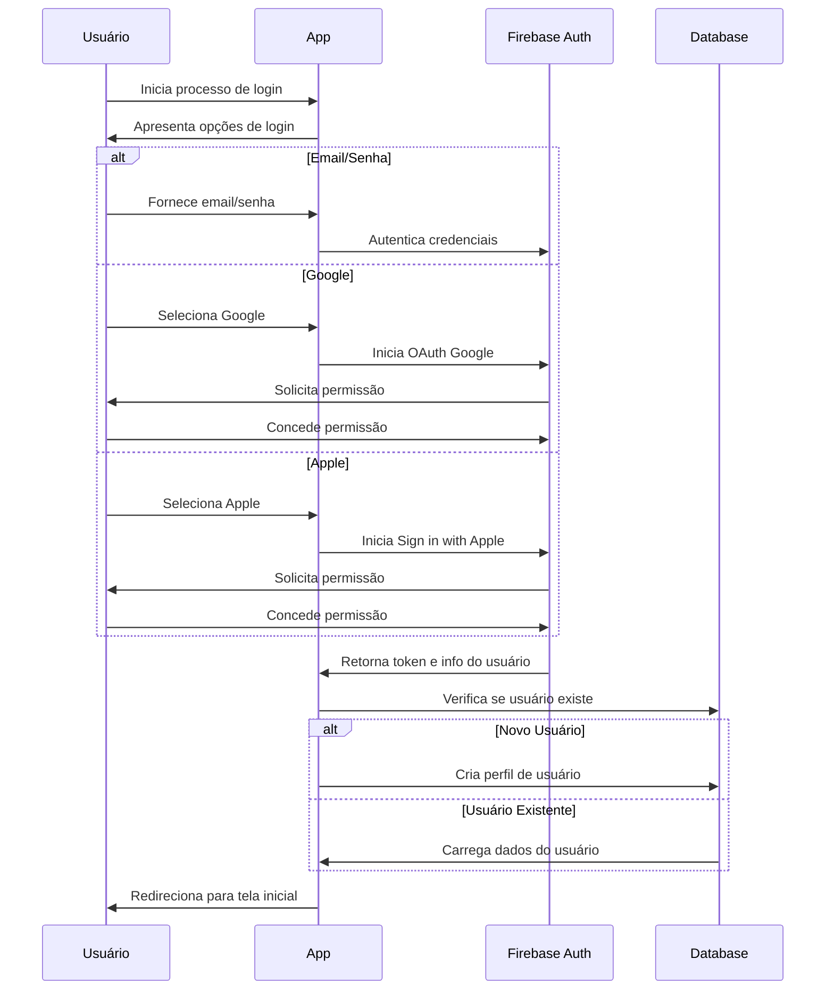
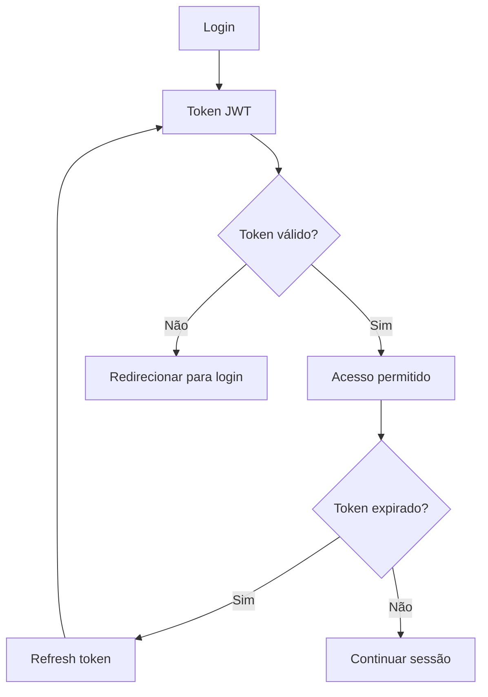
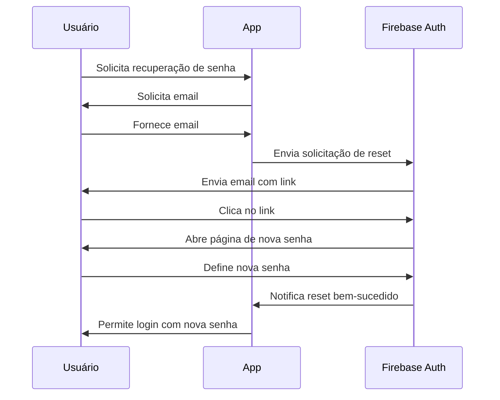

# Sistema de Autenticação

## Visão Geral

O sistema de autenticação do Osiris Rise permite que os usuários criem contas, façam login e gerenciem seus perfis de forma segura. Implementamos múltiplos métodos de autenticação para facilitar o acesso e garantir a segurança dos dados.

## Fluxo de Autenticação



## Métodos de Autenticação

### Email e Senha

O método tradicional de autenticação com email e senha oferece:

- Validação de formato de email
- Requisitos de senha forte
- Proteção contra tentativas excessivas de login
- Recuperação de senha via email

### Provedores Sociais

Autenticação simplificada através de contas existentes:

- **Google**: Login com conta Google
- **Apple**: Sign in with Apple (obrigatório para apps iOS)

### Autenticação Anônima

Permitimos que novos usuários experimentem o aplicativo sem criar uma conta:

- Acesso imediato às funcionalidades básicas
- Opção de converter para conta permanente posteriormente
- Dados preservados durante a conversão

## Segurança

### Armazenamento de Credenciais

- Senhas armazenadas com hash e salt no Firebase Auth
- Tokens de acesso armazenados em área segura do dispositivo
- Nenhuma credencial armazenada em texto plano

### Proteção de Sessão



- Tokens JWT com tempo de expiração
- Refresh tokens para renovação automática
- Invalidação de tokens em logout
- Detecção de dispositivos não reconhecidos

## Gerenciamento de Perfil

### Informações do Usuário

Os usuários podem gerenciar:

- Nome de exibição
- Foto de perfil
- Email (com verificação)
- Senha (alteração segura)
- Preferências e configurações

### Privacidade e Permissões

Controles de privacidade disponíveis:

- Visibilidade de progresso
- Compartilhamento de conquistas
- Notificações e comunicações
- Exportação de dados pessoais

## Implementação Técnica

### Firebase Authentication

Utilizamos o Firebase Authentication como provedor principal:

```dart
// Exemplo de login com email/senha
Future<User?> signInWithEmailPassword(String email, String password) async {
  try {
    final UserCredential userCredential = 
        await _auth.signInWithEmailAndPassword(
      email: email,
      password: password,
    );
    return userCredential.user;
  } on FirebaseAuthException catch (e) {
    // Tratamento de erros específicos
    if (e.code == 'user-not-found') {
      throw AuthException('Usuário não encontrado');
    } else if (e.code == 'wrong-password') {
      throw AuthException('Senha incorreta');
    }
    throw AuthException('Erro de autenticação: ${e.message}');
  }
}

// Exemplo de login com Google
Future<User?> signInWithGoogle() async {
  final GoogleSignInAccount? googleUser = await _googleSignIn.signIn();
  if (googleUser == null) return null;
  
  final GoogleSignInAuthentication googleAuth = 
      await googleUser.authentication;
  final credential = GoogleAuthProvider.credential(
    accessToken: googleAuth.accessToken,
    idToken: googleAuth.idToken,
  );
  
  final UserCredential userCredential = 
      await _auth.signInWithCredential(credential);
  return userCredential.user;
}
```

### Persistência de Estado

Gerenciamos o estado de autenticação usando:

```dart
// Stream de mudanças no estado de autenticação
Stream<User?> get authStateChanges => _auth.authStateChanges();

// Provider para acesso ao usuário atual em toda a aplicação
class AuthProvider extends ChangeNotifier {
  User? _currentUser;
  
  User? get currentUser => _currentUser;
  
  AuthProvider() {
    _auth.authStateChanges().listen((User? user) {
      _currentUser = user;
      notifyListeners();
    });
  }
  
  // Métodos de autenticação...
}
```

## Recuperação de Conta

### Fluxo de Recuperação de Senha



## Exclusão de Conta

Os usuários podem excluir suas contas permanentemente:

- Confirmação de múltiplas etapas
- Opção de exportar dados antes da exclusão
- Remoção completa de todos os dados pessoais
- Período de "arrependimento" de 14 dias

## Testes e Validação

### Testes Automatizados

Garantimos a qualidade com:

- Testes unitários para lógica de autenticação
- Testes de integração para fluxos completos
- Testes de UI para interações de usuário
- Testes de segurança para vulnerabilidades

### Métricas de Monitoramento

Monitoramos constantemente:

- Taxa de sucesso de login
- Tempo médio de autenticação
- Distribuição de métodos de login
- Falhas de autenticação por tipo

## Próximos Passos

- [Contador de Recaídas](relapse-counter.md) - Explore esta funcionalidade central
- [Perfil de Usuário](user-profile.md) - Saiba mais sobre o gerenciamento de perfil
- [Configurações de Privacidade](privacy-settings.md) - Conheça as opções de privacidade