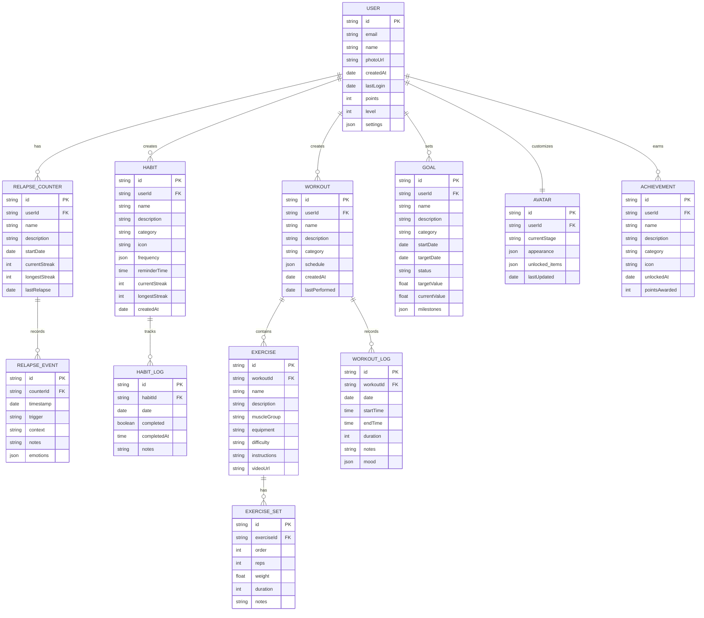

# Modelo de Dados

## Visão Geral

O modelo de dados do Osiris Rise foi projetado para suportar todas as funcionalidades do aplicativo de forma eficiente, mantendo a integridade dos dados e permitindo consultas rápidas para as operações mais comuns.

## Diagrama de Entidade-Relacionamento



## Entidades Principais

### User (Usuário)

A entidade central que representa um usuário do aplicativo.

**Atributos principais:**
- `id`: Identificador único
- `email`: Email do usuário (usado para autenticação)
- `name`: Nome do usuário
- `photoUrl`: URL da foto de perfil
- `points`: Pontos acumulados no sistema de gamificação
- `level`: Nível atual no sistema de gamificação

**Relacionamentos:**
- Um usuário pode ter múltiplos contadores de recaídas
- Um usuário pode criar múltiplos hábitos
- Um usuário pode criar múltiplos treinos
- Um usuário pode definir múltiplas metas
- Um usuário personaliza um avatar
- Um usuário pode ganhar múltiplas conquistas

### Avatar

Representa a visualização do progresso do usuário.

**Atributos principais:**
- `currentStage`: Estágio atual de evolução
- `appearance`: Características visuais (JSON)
- `unlocked_items`: Itens desbloqueados (JSON)

**Relacionamentos:**
- Pertence a um único usuário

### RelapseCounter (Contador de Recaídas)

Rastreia o progresso na superação de um vício específico.

**Atributos principais:**
- `name`: Nome do contador (ex: "Parar de fumar")
- `startDate`: Data de início da contagem
- `currentStreak`: Sequência atual de dias sem recaídas
- `longestStreak`: Maior sequência histórica

**Relacionamentos:**
- Pertence a um usuário
- Contém múltiplos eventos de recaída

### RelapseEvent (Evento de Recaída)

Registra uma recaída específica.

**Atributos principais:**
- `timestamp`: Data e hora da recaída
- `trigger`: O que desencadeou a recaída
- `context`: Contexto em que ocorreu
- `emotions`: Emoções associadas (JSON)

**Relacionamentos:**
- Pertence a um contador de recaídas

### Habit (Hábito)

Representa um hábito que o usuário deseja desenvolver.

**Atributos principais:**
- `name`: Nome do hábito
- `category`: Categoria (saúde, produtividade, etc.)
- `frequency`: Frequência desejada (JSON)
- `reminderTime`: Horário do lembrete
- `currentStreak`: Sequência atual de dias completados

**Relacionamentos:**
- Pertence a um usuário
- Contém múltiplos registros de conclusão

### Workout (Treino)

Representa um treino físico criado pelo usuário.

**Atributos principais:**
- `name`: Nome do treino
- `category`: Categoria (força, cardio, etc.)
- `schedule`: Programação semanal (JSON)
- `lastPerformed`: Última vez que foi realizado

**Relacionamentos:**
- Pertence a um usuário
- Contém múltiplos exercícios
- Tem múltiplos registros de execução

## Implementação no Firebase

O Osiris Rise utiliza o Firebase Firestore como banco de dados principal. Abaixo está a estrutura de coleções:

```
/users/{userId}
/users/{userId}/relapseCounters/{counterId}
/users/{userId}/relapseCounters/{counterId}/events/{eventId}
/users/{userId}/habits/{habitId}
/users/{userId}/habits/{habitId}/logs/{logId}
/users/{userId}/workouts/{workoutId}
/users/{userId}/workouts/{workoutId}/exercises/{exerciseId}
/users/{userId}/workoutLogs/{logId}
/users/{userId}/goals/{goalId}
/users/{userId}/achievements/{achievementId}
/avatars/{userId}
```

## Armazenamento Local

Para suporte offline e melhor performance, o aplicativo mantém uma cópia local dos dados usando SQLite. A sincronização ocorre automaticamente quando o dispositivo está online.

## Exemplos de Documentos

### Exemplo de Documento de Usuário

```json
{
  "id": "user123",
  "email": "user@example.com",
  "name": "John Doe",
  "photoUrl": "https://example.com/photo.jpg",
  "createdAt": "2023-01-15T10:30:00Z",
  "lastLogin": "2023-06-20T08:45:12Z",
  "points": 1250,
  "level": 8,
  "settings": {
    "notifications": true,
    "darkMode": true,
    "language": "pt-BR"
  }
}
```

### Exemplo de Contador de Recaídas

```json
{
  "id": "counter456",
  "userId": "user123",
  "name": "Parar de fumar",
  "description": "Minha jornada para abandonar o cigarro",
  "startDate": "2023-02-01T00:00:00Z",
  "currentStreak": 15,
  "longestStreak": 30,
  "lastRelapse": "2023-06-05T18:20:00Z"
}
```

### Exemplo de Hábito

```json
{
  "id": "habit789",
  "userId": "user123",
  "name": "Meditação",
  "description": "Meditar pela manhã",
  "category": "mindfulness",
  "icon": "meditation",
  "frequency": {
    "type": "daily",
    "days": [1, 2, 3, 4, 5, 6, 7]
  },
  "reminderTime": "07:00:00",
  "currentStreak": 8,
  "longestStreak": 21,
  "createdAt": "2023-03-10T14:25:00Z"
}
```

## Considerações de Performance

### Índices

Para otimizar consultas comuns, os seguintes índices são criados no Firestore:

1. `users/{userId}/habits`, `completed` (ASC), `date` (DESC)
2. `users/{userId}/relapseCounters`, `currentStreak` (DESC)
3. `users/{userId}/workoutLogs`, `workoutId` (ASC), `date` (DESC)

### Consultas Otimizadas

Exemplos de consultas otimizadas:

```dart
// Obter hábitos ativos do usuário
final habitsRef = firestore
  .collection('users')
  .doc(userId)
  .collection('habits')
  .where('active', isEqualTo: true);

// Obter treinos realizados no último mês
final workoutLogsRef = firestore
  .collection('users')
  .doc(userId)
  .collection('workoutLogs')
  .where('date', isGreaterThanOrEqualTo: oneMonthAgo)
  .orderBy('date', descending: true);
```

## Estratégia de Migração

Para atualizações futuras do modelo de dados, seguimos uma estratégia de migração gradual:

1. Adicionar novos campos com valores padrão
2. Atualizar o aplicativo para usar os novos campos
3. Migrar dados antigos em background
4. Remover suporte para o formato antigo

## Próximos Passos

- [Arquitetura do Sistema](architecture-overview.md) - Entenda como o modelo de dados se integra à arquitetura
- [Contador de Recaídas](relapse-counter.md) - Veja como esta funcionalidade utiliza o modelo de dados
- [Sistema de Hábitos](habit-tracking.md) - Explore a implementação do rastreamento de hábitos