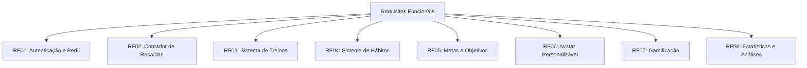

# Requisitos Funcionais

## Visão Geral

Os requisitos funcionais descrevem as capacidades e comportamentos específicos que o Osiris Rise deve implementar para atender às necessidades dos usuários.

## Lista de Requisitos

## RF01: Sistema de Autenticação e Perfil

### Descrição
O sistema deve permitir que usuários criem contas, façam login e gerenciem seus perfis.

### Requisitos Detalhados
- **RF01.1**: Registro de novos usuários com email e senha
- **RF01.2**: Login via email/senha e provedores sociais (Google, Apple)
- **RF01.3**: Recuperação de senha
- **RF01.4**: Edição de perfil (nome, foto, informações pessoais)
- **RF01.5**: Configurações de privacidade
- **RF01.6**: Exclusão de conta

## RF02: Contador de Recaídas

### Descrição
O sistema deve permitir que usuários rastreiem períodos de abstinência de vícios e registrem recaídas.

### Requisitos Detalhados
- **RF02.1**: Rastreamento de dias consecutivos sem recaídas
- **RF02.2**: Registro de recaídas com data, gatilho e contexto
- **RF02.3**: Reinício da contagem após recaída
- **RF02.4**: Visualização de histórico de recaídas
- **RF02.5**: Análise de padrões de recaídas
- **RF02.6**: Suporte a múltiplos contadores para diferentes vícios

## RF03: Sistema de Gerenciamento de Treinos

### Descrição
O sistema deve permitir que usuários criem, gerenciem e acompanhem seus treinos físicos.

### Requisitos Detalhados
- **RF03.1**: Criação de treinos personalizados
- **RF03.2**: Biblioteca de exercícios com instruções
- **RF03.3**: Registro de séries, repetições e pesos
- **RF03.4**: Cronômetro para intervalos entre séries
- **RF03.5**: Histórico de treinos realizados
- **RF03.6**: Gráficos de progresso de carga e volume
- **RF03.7**: Compartilhamento de treinos

## RF04: Sistema de Hábitos

### Descrição
O sistema deve permitir que usuários criem, gerenciem e acompanhem hábitos diários ou semanais.

### Requisitos Detalhados
- **RF04.1**: Criação de hábitos personalizados
- **RF04.2**: Definição de frequência (diária, semanal)
- **RF04.3**: Lembretes para hábitos
- **RF04.4**: Rastreamento de sequência de hábitos completados
- **RF04.5**: Visualização de calendário de hábitos
- **RF04.6**: Categorização de hábitos (saúde, produtividade, etc.)

## RF05: Metas e Objetivos

### Descrição
O sistema deve permitir que usuários definam e acompanhem metas de curto, médio e longo prazo.

### Requisitos Detalhados
- **RF05.1**: Criação de metas com prazo e critérios de sucesso
- **RF05.2**: Divisão de metas em sub-objetivos
- **RF05.3**: Acompanhamento de progresso das metas
- **RF05.4**: Notificações de prazos
- **RF05.5**: Celebração de metas alcançadas

## RF06: Avatar Personalizável

### Descrição
O sistema deve oferecer um avatar que evolui conforme o progresso do usuário.

### Requisitos Detalhados
- **RF06.1**: Criação de avatar inicial
- **RF06.2**: Evolução visual baseada em progresso
- **RF06.3**: Desbloqueio de itens e customizações
- **RF06.4**: Reflexo visual de recaídas e recuperação
- **RF06.5**: Compartilhamento de avatar

## RF07: Gamificação

### Descrição
O sistema deve implementar elementos de gamificação para aumentar o engajamento.

### Requisitos Detalhados
- **RF07.1**: Sistema de pontos por atividades
- **RF07.2**: Níveis de progresso
- **RF07.3**: Conquistas e medalhas
- **RF07.4**: Desafios diários e semanais
- **RF07.5**: Tabelas de classificação (opcional)
- **RF07.6**: Sistema de recompensas

## RF08: Estatísticas e Análises

### Descrição
O sistema deve fornecer estatísticas e análises sobre o progresso do usuário.

### Requisitos Detalhados
- **RF08.1**: Dashboard com visão geral
- **RF08.2**: Gráficos de progresso
- **RF08.3**: Análise de tendências
- **RF08.4**: Relatórios semanais/mensais
- **RF08.5**: Exportação de dados
- **RF08.6**: Insights personalizados