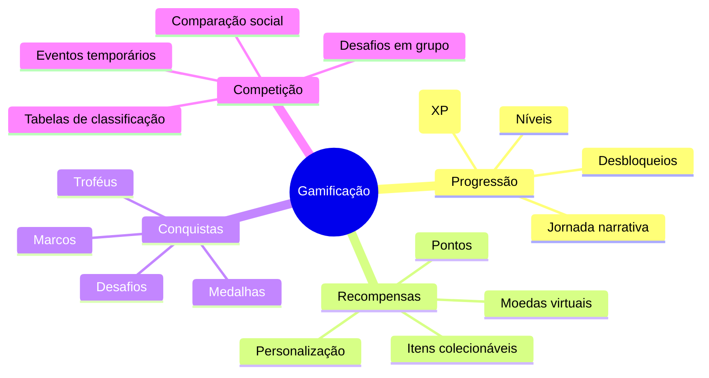
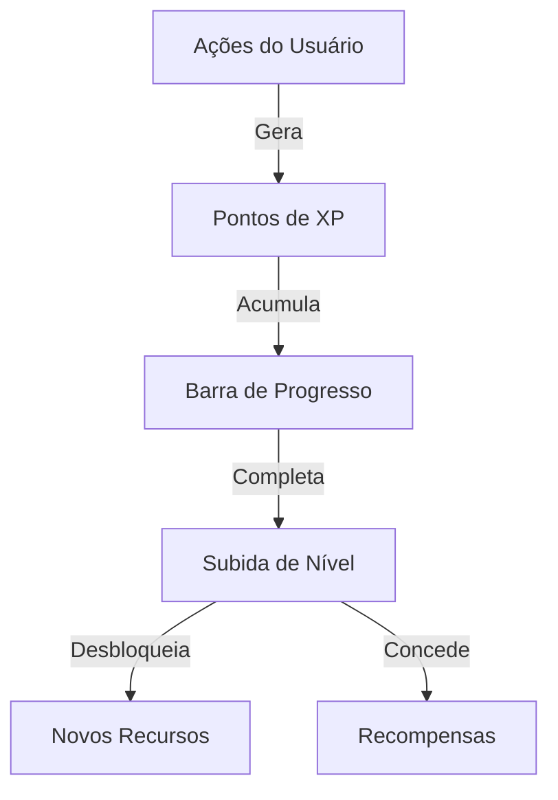
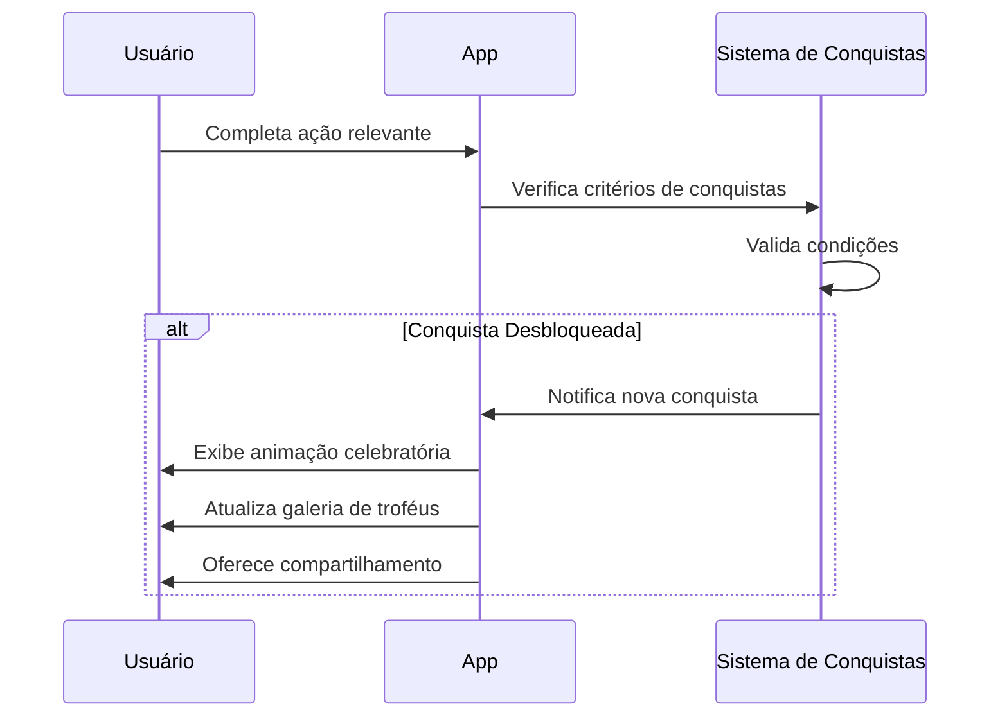
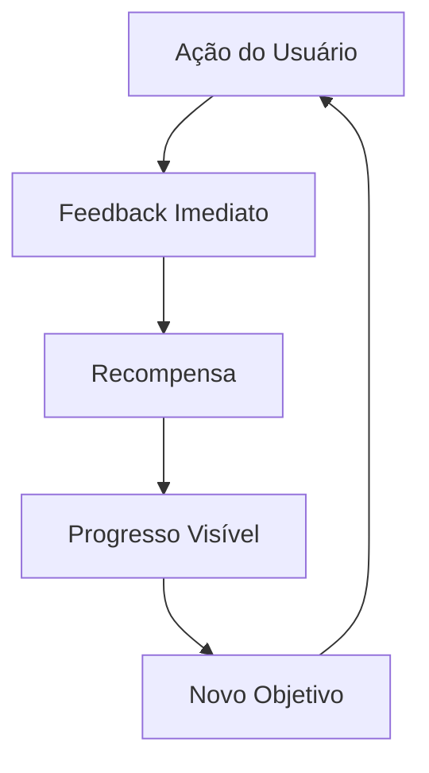

# Sistema de Gamificação

## Visão Geral

O Sistema de Gamificação do Osiris Rise transforma a jornada de transformação pessoal em uma experiência envolvente e motivadora, utilizando elementos de jogos para incentivar comportamentos positivos e celebrar o progresso. Esta abordagem aumenta o engajamento e a retenção, tornando o processo de mudança mais divertido e gratificante.

## Elementos de Gamificação



## Sistema de Progressão

### Níveis e Experiência

O usuário progride através de níveis que representam seu desenvolvimento:

- **Pontos de Experiência (XP)**: Ganhos por completar ações positivas
- **Níveis**: Alcançados ao acumular determinada quantidade de XP
- **Curva de Progressão**: Níveis mais altos requerem mais XP
- **Benefícios por Nível**: Desbloqueio de recursos e personalização



### Jornada Narrativa

A progressão é contextualizada em uma narrativa inspirada na mitologia egípcia:

- **Capítulos**: Representam fases da jornada de transformação
- **Personagens**: Deuses e figuras mitológicas como mentores
- **Desafios Temáticos**: Provas inspiradas em mitos
- **Transformação Visual**: Avatar evolui refletindo a narrativa

## Sistema de Recompensas

### Economia Virtual

O aplicativo implementa uma economia interna:

- **Pontos de Ação**: Ganhos por atividades diárias
- **Moedas Osiris**: Moeda premium para itens especiais
- **Fragmentos de Alma**: Coletados por superar desafios difíceis
- **Essência Vital**: Recurso regenerativo para ações especiais

### Itens e Personalização

Recompensas que o usuário pode obter:

- **Itens Cosméticos**: Personalização do avatar
- **Temas de Interface**: Aparência do aplicativo
- **Efeitos Visuais**: Animações especiais
- **Conteúdo Exclusivo**: Meditações, exercícios e histórias

## Sistema de Conquistas

### Tipos de Conquistas

O sistema inclui diversas categorias de conquistas:

- **Marcos de Progresso**: Baseados em tempo e consistência
- **Desafios de Habilidade**: Requerem domínio de técnicas específicas
- **Conquistas Sociais**: Interação com a comunidade
- **Conquistas Secretas**: Descobertas através da exploração
- **Coleções**: Conjuntos de itens relacionados

### Exibição e Compartilhamento

As conquistas são apresentadas de forma atraente:

- **Galeria de Troféus**: Visualização de todas as conquistas
- **Notificações Celebratórias**: Animações especiais ao desbloquear
- **Compartilhamento Social**: Opção de compartilhar conquistas
- **Histórico de Desbloqueios**: Linha do tempo de realizações



## Competição e Cooperação

### Tabelas de Classificação

O sistema oferece comparação social saudável:

- **Rankings Semanais**: Baseados em atividade recente
- **Categorias Específicas**: Por tipo de hábito ou desafio
- **Grupos Personalizados**: Competição entre amigos
- **Ligas**: Agrupamento por nível de atividade similar

### Desafios em Grupo

Elementos cooperativos e competitivos:

- **Desafios Comunitários**: Metas coletivas para todos os usuários
- **Grupos de Apoio**: Equipes que trabalham juntas
- **Eventos Temporários**: Competições por tempo limitado
- **Mentoria**: Sistema de parceria entre usuários

## Implementação Técnica

### Sistema de Pontuação

```dart
// Exemplo de sistema de pontuação
class PointsService {
  // Conceder XP ao usuário
  Future<void> awardXP(String userId, int amount, String source) async {
    // Obter usuário atual
    final user = await _userRepository.getById(userId);
    
    // Calcular XP total e verificar subida de nível
    final int newTotalXP = user.totalXP + amount;
    final int oldLevel = _calculateLevel(user.totalXP);
    final int newLevel = _calculateLevel(newTotalXP);
    
    // Atualizar usuário
    user.totalXP = newTotalXP;
    
    // Registrar transação
    await _transactionRepository.add(XPTransaction(
      userId: userId,
      amount: amount,
      source: source,
      timestamp: DateTime.now(),
    ));
    
    // Verificar subida de nível
    if (newLevel > oldLevel) {
      // Processar subida de nível
      await _processLevelUp(userId, oldLevel, newLevel);
    }
    
    // Atualizar usuário no banco de dados
    await _userRepository.update(user);
  }
  
  // Calcular nível baseado em XP total
  int _calculateLevel(int totalXP) {
    // Fórmula de progressão: cada nível requer mais XP que o anterior
    // Exemplo: nível n requer 100 * n² XP
    return sqrt(totalXP / 100).floor();
  }
  
  // Processar subida de nível
  Future<void> _processLevelUp(
      String userId, int oldLevel, int newLevel) async {
    // Conceder recompensas de nível
    await _rewardsService.grantLevelRewards(userId, newLevel);
    
    // Desbloquear novos recursos
    await _unlockService.processLevelUnlocks(userId, newLevel);
    
    // Notificar usuário
    await _notificationService.sendLevelUpNotification(userId, newLevel);
    
    // Verificar conquistas relacionadas a níveis
    await _achievementService.checkLevelAchievements(userId, newLevel);
  }
}
```

### Sistema de Conquistas

```dart
// Exemplo de sistema de conquistas
class AchievementService {
  // Verificar conquistas após uma ação
  Future<List<Achievement>> checkAchievements(
      String userId, String actionType, Map<String, dynamic> data) async {
    // Obter conquistas não desbloqueadas do usuário
    final unlockedAchievements = 
        await _userAchievementRepository.getUnlockedByUserId(userId);
    final allAchievements = await _achievementRepository.getAll();
    
    final lockedAchievements = allAchievements
        .where((a) => !unlockedAchievements.contains(a.id))
        .toList();
    
    // Filtrar conquistas relevantes para a ação
    final relevantAchievements = lockedAchievements
        .where((a) => a.triggerAction == actionType)
        .toList();
    
    // Verificar cada conquista
    final List<Achievement> newlyUnlocked = [];
    
    for (final achievement in relevantAchievements) {
      final bool isUnlocked = await _checkAchievementCriteria(
          userId, achievement, data);
      
      if (isUnlocked) {
        // Desbloquear conquista
        await _unlockAchievement(userId, achievement);
        newlyUnlocked.add(achievement);
      }
    }
    
    return newlyUnlocked;
  }
  
  // Verificar critérios específicos de uma conquista
  Future<bool> _checkAchievementCriteria(
      String userId, Achievement achievement, Map<String, dynamic> data) async {
    switch (achievement.type) {
      case AchievementType.STREAK:
        // Verificar sequência de dias
        final int requiredStreak = achievement.criteria['streakDays'];
        final int currentStreak = data['currentStreak'] ?? 0;
        return currentStreak >= requiredStreak;
        
      case AchievementType.COUNT:
        // Verificar contagem total
        final int requiredCount = achievement.criteria['count'];
        final int totalCount = await _getTotalCount(
            userId, achievement.criteria['countType']);
        return totalCount >= requiredCount;
        
      case AchievementType.COLLECTION:
        // Verificar coleção completa
        final List<String> requiredItems = achievement.criteria['items'];
        final List<String> userItems = 
            await _getUserItems(userId, achievement.criteria['itemType']);
        return requiredItems.every((item) => userItems.contains(item));
        
      // Outros tipos de conquistas...
      
      default:
        return false;
    }
  }
  
  // Desbloquear uma conquista
  Future<void> _unlockAchievement(
      String userId, Achievement achievement) async {
    // Registrar desbloqueio
    await _userAchievementRepository.add(UserAchievement(
      userId: userId,
      achievementId: achievement.id,
      unlockedAt: DateTime.now(),
    ));
    
    // Conceder recompensas
    if (achievement.rewards != null) {
      await _rewardsService.grantAchievementRewards(
          userId, achievement.rewards);
    }
    
    // Enviar notificação
    await _notificationService.sendAchievementNotification(
        userId, achievement);
  }
}
```

## Balanceamento e Engajamento

### Curvas de Dificuldade

O sistema é cuidadosamente balanceado para manter o engajamento:

- **Onboarding Suave**: Conquistas fáceis no início
- **Progressão Gradual**: Aumento gradual de dificuldade
- **Variedade de Desafios**: Diferentes tipos de objetivos
- **Recompensas Proporcionais**: Maiores recompensas para tarefas mais difíceis

### Ciclos de Engajamento



O sistema implementa múltiplos ciclos de engajamento:

- **Ciclo Curto**: Feedback imediato após ações
- **Ciclo Médio**: Conquistas diárias e semanais
- **Ciclo Longo**: Progressão de nível e narrativa

## Integração com Outras Funcionalidades

### Contador de Recaídas

- Sequências sem recaídas geram XP e conquistas
- Marcos importantes desbloqueiam recompensas especiais
- Superação de recaídas oferece mecânicas de recuperação

### Sistema de Hábitos

- Hábitos consistentes alimentam o sistema de progressão
- Desafios temáticos baseados em categorias de hábitos
- Sequências de hábitos desbloqueiam conquistas específicas

### Sistema de Treinos

- Conclusão de treinos gera pontos e XP
- Progressão de carga/resistência desbloqueia conquistas
- Consistência em treinos reflete na evolução do avatar

## Personalização e Acessibilidade

O sistema de gamificação é adaptável às preferências do usuário:

- **Intensidade**: Ajuste do nível de elementos de gamificação
- **Foco**: Priorização de certos tipos de recompensas
- **Privacidade**: Controle sobre elementos sociais e compartilhamento
- **Acessibilidade**: Alternativas para elementos visuais

## Próximos Passos

- [Avatar Personalizável](avatar-system.md) - Veja como seu avatar evolui
- [Sistema de Hábitos](habit-tracking.md) - Entenda a integração com hábitos
- [Contador de Recaídas](relapse-counter.md) - Explore a conexão com abstinência