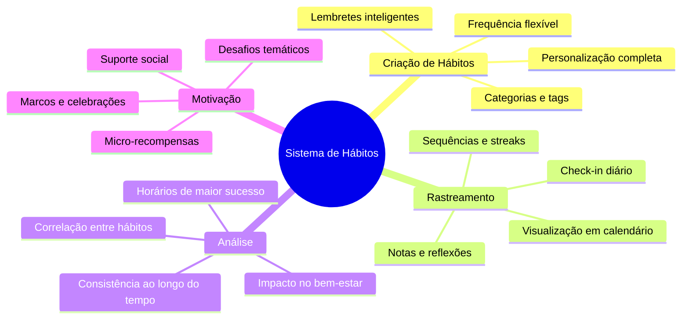
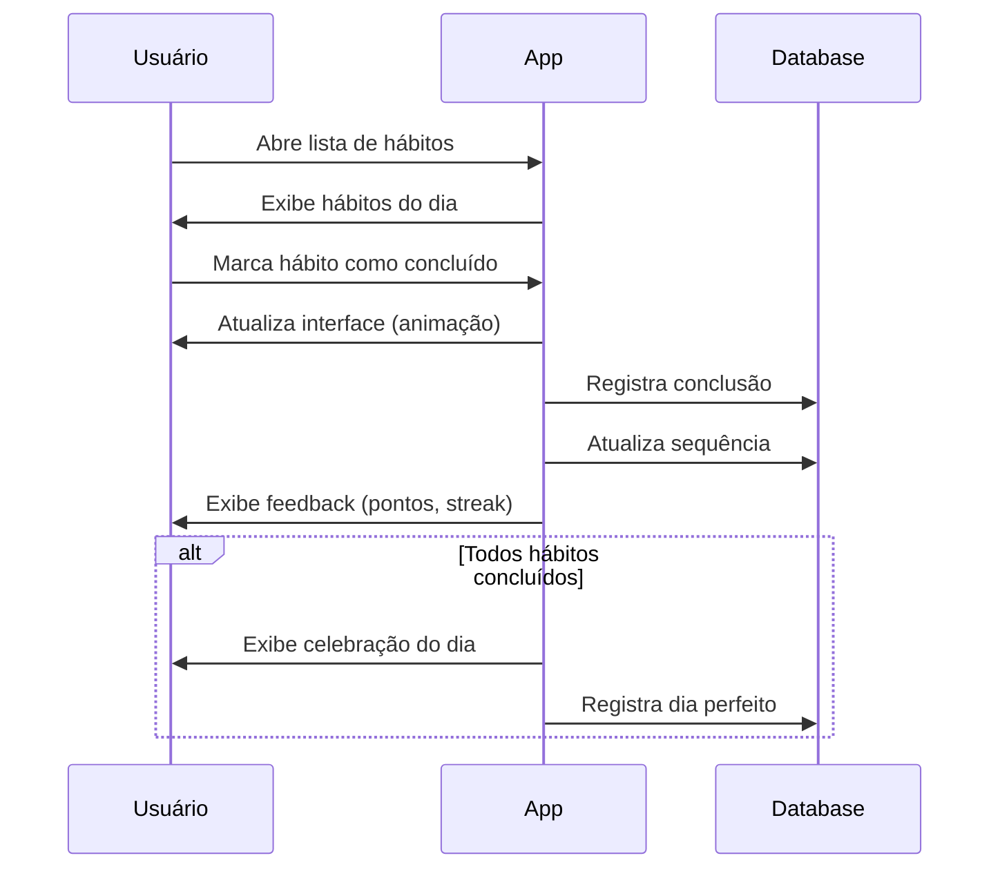
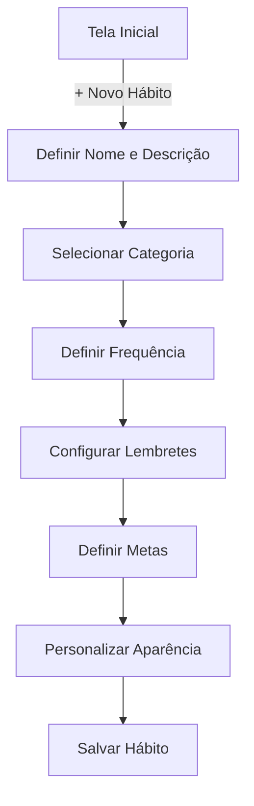
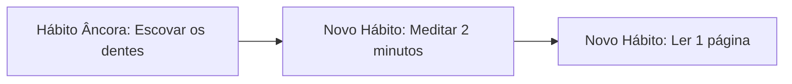

# Sistema de Hábitos

## Visão Geral

O Sistema de Hábitos do Osiris Rise permite que os usuários desenvolvam e mantenham rotinas positivas que apoiam sua jornada de transformação pessoal. Esta funcionalidade foi projetada para ajudar na criação de novos comportamentos saudáveis e na substituição de padrões negativos.

## Funcionalidades Principais



## Interface do Usuário

### Tela Principal

A tela principal do sistema de hábitos apresenta:

1. **Lista de Hábitos**: Hábitos do dia com status
2. **Progresso Visual**: Representação gráfica da consistência
3. **Sequências Atuais**: Dias consecutivos por hábito
4. **Estatísticas Rápidas**: Resumo de performance
5. **Botões de Ação**: Adicionar hábito, ver análises, configurar


### Fluxo de Check-in



## Criação de Hábitos

### Fluxo de Criação



1. Usuário inicia criação de novo hábito
2. Define nome e descrição detalhada
3. Seleciona categoria (saúde, produtividade, etc.)
4. Define frequência (diário, dias específicos, intervalo)
5. Configura lembretes e notificações
6. Define metas de sequência e consistência
7. Personaliza ícone e cor para identificação visual

### Tipos de Hábitos

O sistema suporta diferentes tipos de hábitos:

- **Sim/Não**: Simples marcação de conclusão
- **Contagem**: Número de ocorrências (ex: copos d'água)
- **Temporizador**: Duração da atividade (ex: meditação)
- **Lista de Verificação**: Múltiplos passos para completar
- **Medição**: Valor numérico (ex: peso, passos)

## Rastreamento e Visualização

### Visualizações de Calendário

O sistema oferece múltiplas visualizações:

- **Calendário Mensal**: Visão geral da consistência
- **Heatmap Anual**: Padrão de conclusão ao longo do ano
- **Linha do Tempo**: Evolução de hábitos específicos
- **Visão Semanal**: Foco na semana atual e planejamento

### Métricas Rastreadas

Para cada hábito, o sistema monitora:

- **Taxa de Conclusão**: Percentual de dias concluídos
- **Sequência Atual**: Dias consecutivos atuais
- **Sequência Recorde**: Maior sequência histórica
- **Consistência**: Padrão de conclusão ao longo do tempo
- **Horários**: Momentos do dia com maior taxa de conclusão

## Estratégias de Formação de Hábitos

### Técnicas Implementadas

O sistema incorpora técnicas cientificamente comprovadas:

- **Empilhamento de Hábitos**: Associar novo hábito a um existente
- **Ambiente**: Lembretes contextuais baseados em localização
- **Mínimo Viável**: Versões simplificadas para iniciar (mini-hábitos)
- **Implementação de Intenções**: Planos "se-então" para situações específicas
- **Contratos de Compromisso**: Declarações de intenção compartilháveis

### Exemplo de Empilhamento



## Implementação Técnica

### Modelo de Dados

```dart
// Modelo de Hábito
class Habit {
  final String id;
  final String userId;
  final String name;
  final String description;
  final String category;
  final String icon;
  final Color color;
  final HabitType type;
  final HabitFrequency frequency;
  final List<HabitReminder> reminders;
  final DateTime createdAt;
  int currentStreak;
  int longestStreak;
  double completionRate;
  
  // Mét