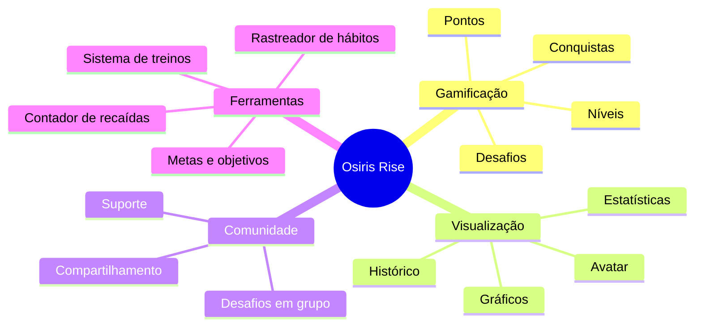

# Introdução ao Osiris Rise

## Visão Geral

Osiris Rise é um aplicativo de transformação pessoal gamificado inspirado na mitologia egípcia, especificamente no mito de Osíris - o deus que morreu e renasceu, simbolizando transformação e renovação.

## Problema

Muitas pessoas lutam contra vícios e hábitos prejudiciais, enfrentando desafios como:

- Falta de motivação consistente
- Dificuldade em visualizar o progresso
- Ausência de recompensas imediatas por comportamentos positivos
- Isolamento durante o processo de recuperação

## Solução

O Osiris Rise aborda esses desafios através de:

## Público-Alvo

- Pessoas em recuperação de vícios (substâncias, pornografia, jogos, etc.)
- Indivíduos buscando desenvolver hábitos saudáveis
- Pessoas interessadas em acompanhar seu progresso físico e mental
- Usuários que apreciam elementos de gamificação e recompensas

## Diferencial

O que torna o Osiris Rise único:

1. **Abordagem Holística**: Integra recuperação de vícios, desenvolvimento de hábitos e condicionamento físico
2. **Avatar Evolutivo**: Representação visual do progresso que evolui conforme o usuário avança
3. **Narrativa Mitológica**: Jornada inspirada na mitologia egípcia, adicionando significado ao processo
4. **Gamificação Profunda**: Sistema de recompensas cuidadosamente projetado para motivação sustentável

## Objetivos do Projeto

- Criar uma ferramenta eficaz para superação de vícios
- Promover o desenvolvimento de hábitos saudáveis
- Oferecer visualização clara do progresso pessoal
- Construir uma comunidade de apoio
- Tornar a transformação pessoal mais engajante e recompensadora

## Próximos Passos

- [Requisitos Funcionais](functional-requirements.md) - Conheça as funcionalidades detalhadas
- [Arquitetura](architecture-overview.md) - Entenda como o sistema é estruturado
- [Contador de Recaídas](relapse-counter.md) - Explore uma das principais funcionalidades