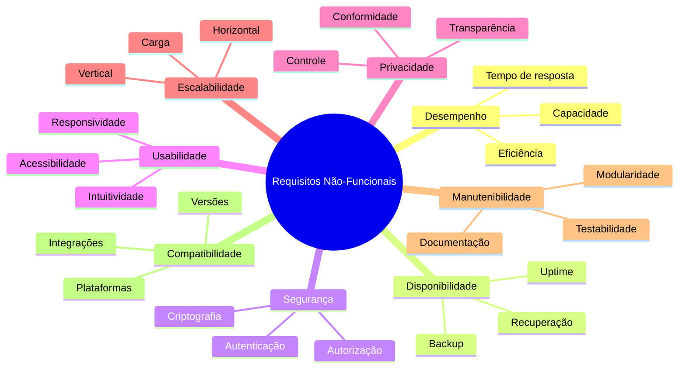

# Requisitos Não-Funcionais

## Visão Geral

Os requisitos não-funcionais definem as características e restrições do sistema que não estão relacionadas diretamente às funcionalidades, mas são essenciais para a qualidade, desempenho e segurança do Osiris Rise.

## Categorias de Requisitos Não-Funcionais

## RNF01: Desempenho

### Descrição
O sistema deve operar com eficiência e responder rapidamente às interações do usuário.

### Requisitos Detalhados
- **RNF01.1**: O tempo de carregamento inicial do aplicativo deve ser inferior a 3 segundos em conexões 4G
- **RNF01.2**: As transições entre telas devem ocorrer em menos de 0,5 segundos
- **RNF01.3**: O sistema deve suportar até 100.000 usuários simultâneos
- **RNF01.4**: O consumo de bateria não deve exceder 5% por hora de uso ativo
- **RNF01.5**: O aplicativo deve funcionar adequadamente em dispositivos com pelo menos 2GB de RAM

## RNF02: Disponibilidade

### Descrição
O sistema deve estar disponível e operacional quando os usuários precisarem.

### Requisitos Detalhados
- **RNF02.1**: O sistema deve ter disponibilidade de 99,9% (downtime máximo de 8,76 horas por ano)
- **RNF02.2**: Manutenções planejadas devem ser agendadas em horários de baixo uso
- **RNF02.3**: O sistema deve ter recuperação automática de falhas quando possível
- **RNF02.4**: Backups completos devem ser realizados diariamente
- **RNF02.5**: O tempo de recuperação após falha não deve exceder 1 hora

## RNF03: Segurança

### Descrição
O sistema deve proteger os dados dos usuários e prevenir acessos não autorizados.

### Requisitos Detalhados
- **RNF03.1**: Todas as senhas devem ser armazenadas com hash e salt
- **RNF03.2**: Todas as comunicações devem ser criptografadas com HTTPS/TLS 1.3