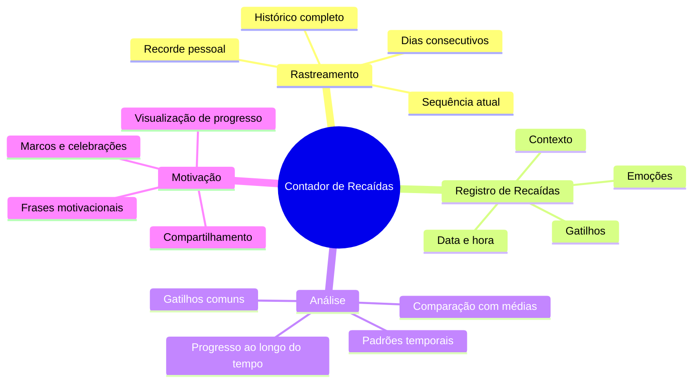
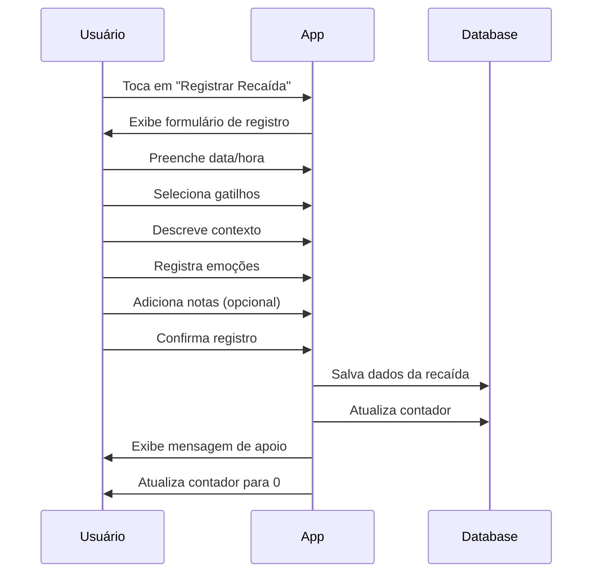
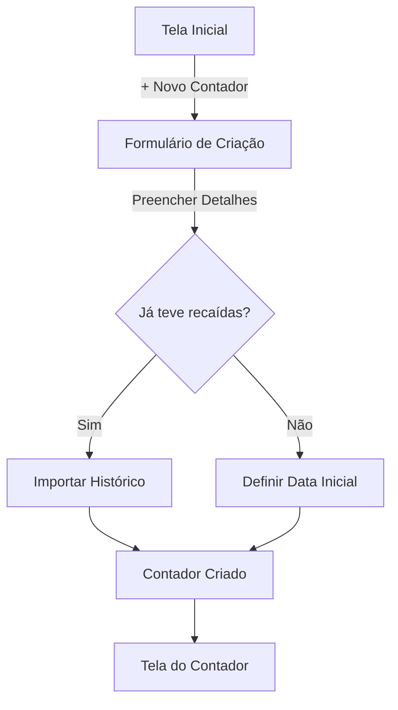
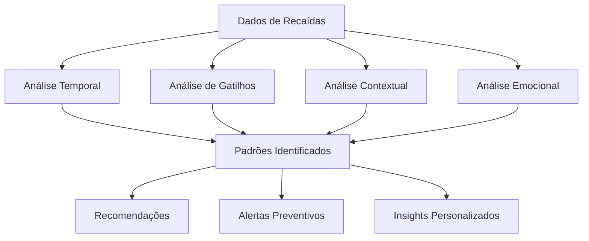

# Contador de Recaídas

## Visão Geral

O Contador de Recaídas é uma funcionalidade central do Osiris Rise, projetada para ajudar usuários a rastrear seu progresso na superação de vícios e comportamentos indesejados. O sistema registra períodos de abstinência, permite o registro de recaídas e oferece insights sobre padrões e gatilhos.

## Funcionalidades Principais



## Interface do Usuário

### Tela Principal

A tela principal do contador apresenta:

1. **Contador de Dias**: Exibe o número de dias consecutivos sem recaídas
2. **Progresso Visual**: Representação gráfica do progresso atual
3. **Recorde Pessoal**: Maior sequência de dias já alcançada
4. **Estatísticas Rápidas**: Resumo de dados importantes
5. **Botões de Ação**: Registrar recaída, ver histórico, análises


### Registro de Recaída

Quando ocorre uma recaída, o usuário pode registrá-la com detalhes:



### Análise de Padrões

A tela de análise oferece insights valiosos:

1. **Calendário de Heatmap**: Visualização de dias com/sem recaídas
2. **Gráficos de Tendência**: Evolução ao longo do tempo
3. **Análise de Gatilhos**: Frequência de diferentes gatilhos
4. **Padrões Temporais**: Horários e dias da semana mais comuns
5. **Correlações**: Relações entre recaídas e outros fatores

## Fluxo de Uso

### Criação de um Novo Contador



1. Usuário acessa a seção de contadores
2. Seleciona "Criar Novo Contador"
3. Define nome e descrição do vício/comportamento
4. Escolhe ícone e cor para identificação visual
5. Define data de início da contagem
6. Opcionalmente importa histórico anterior

### Uso Diário

1. Verificar progresso atual na tela inicial
2. Receber notificações de marcos alcançados
3. Registrar recaídas quando ocorrerem
4. Analisar padrões periodicamente
5. Compartilhar conquistas com suporte selecionado

## Implementação Técnica

### Modelo de Dados

```dart
// Modelo do Contador de Recaídas
class RelapseCounter {
  final String id;
  final String userId;
  final String name;
  final String description;
  final DateTime startDate;
  int currentStreak;
  int longestStreak;
  DateTime? lastRelapse;
  
  // Métodos e lógica...
}

// Modelo de Evento de Recaída
class RelapseEvent {
  final String id;
  final String counterId;
  final DateTime timestamp;
  final List<String> triggers;
  final String context;
  final String notes;
  final Map<String, int> emotions;
  
  // Métodos e lógica...
}
```

### Cálculo de Sequência

```dart
// Cálculo da sequência atual
int calculateCurrentStreak(DateTime startDate, List<RelapseEvent> events) {
  if (events.isEmpty) {
    return DateTime.now().difference(startDate).inDays;
  }
  
  // Ordenar eventos por data (mais recente primeiro)
  events.sort((a, b) => b.timestamp.compareTo(a.timestamp));
  
  // Calcular dias desde a última recaída
  return DateTime.now().difference(events.first.timestamp).inDays;
}

// Atualização após recaída
void recordRelapse(RelapseEvent event) {
  // Salvar evento
  _relapseEventsRepository.add(event);
  
  // Atualizar contador
  final counter = _counterRepository.getById(event.counterId);
  counter.lastRelapse = event.timestamp;
  counter.currentStreak = 0;
  
  // Verificar se precisa atualizar recorde
  int daysSinceLastRelapse = 0;
  if (counter.lastRelapse != null) {
    daysSinceLastRelapse = event.timestamp
        .difference(counter.lastRelapse!)
        .inDays;
  } else {
    daysSinceLastRelapse = event.timestamp
        .difference(counter.startDate)
        .inDays;
  }
  
  if (daysSinceLastRelapse > counter.longestStreak) {
    counter.longestStreak = daysSinceLastRelapse;
  }
  
  _counterRepository.update(counter);
}
```

### Notificações e Lembretes

O sistema envia notificações para:

- Celebrar marcos importantes (1 dia, 1 semana, 1 mês, etc.)
- Lembretes motivacionais em horários configurados
- Alertas em momentos de risco identificados por padrões

```dart
// Agendamento de notificações
void scheduleStreakMilestoneNotifications(RelapseCounter counter) {
  final milestones = [1, 3, 7, 14, 30, 60, 90, 180, 365];
  
  for (final milestone in milestones) {
    if (counter.currentStreak < milestone) {
      final targetDate = DateTime.now().add(
        Duration(days: milestone - counter.currentStreak)
      );
      
      _notificationService.scheduleNotification(
        id: 'streak_${counter.id}_$milestone',
        title: 'Parabéns! 🎉',
        body: 'Você alcançou $milestone dias sem recaídas!',
        scheduledDate: targetDate,
      );
    }
  }
}
```

## Gamificação e Motivação

### Sistema de Recompensas

O contador se integra ao sistema de gamificação:

- **Pontos**: Ganhos por dias consecutivos e marcos alcançados
- **Conquistas**: Desbloqueadas em marcos específicos
- **Evolução do Avatar**: Reflexo visual do progresso
- **Desafios**: Metas específicas relacionadas à abstinência

### Mensagens Motivacionais

O sistema oferece mensagens contextuais:

- Frases motivacionais baseadas no estágio atual
- Conteúdo educativo sobre o processo de recuperação
- Histórias de sucesso de outros usuários
- Dicas personalizadas baseadas em padrões identificados

## Personalização

Os usuários podem personalizar:

- **Múltiplos Contadores**: Rastrear diferentes vícios simultaneamente
- **Categorias de Gatilhos**: Definir categorias relevantes para seu caso
- **Notificações**: Configurar frequência e tipo de alertas
- **Privacidade**: Controlar o compartilhamento de progresso
- **Visualização**: Escolher diferentes estilos de exibição

## Análise Avançada

### Identificação de Padrões

O sistema analisa dados para identificar:



- Horários de maior vulnerabilidade
- Gatilhos mais frequentes
- Contextos de alto risco
- Estados emocionais associados a recaídas

### Relatórios e Exportação

Os usuários podem:

- Gerar relatórios de progresso
- Exportar dados para análise externa
- Compartilhar estatísticas com profissionais de saúde
- Criar PDFs de jornada para reflexão pessoal

## Próximos Passos

- [Sistema de Hábitos](habit-tracking.md) - Integre o contador com hábitos positivos
- [Gamificação](gamification.md) - Entenda como o sistema de recompensas funciona
- [Análise de Dados](data-analysis.md) - Explore recursos avançados de análise