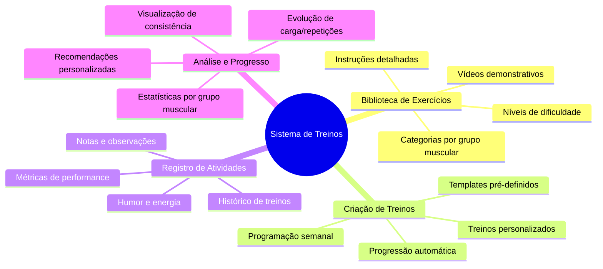
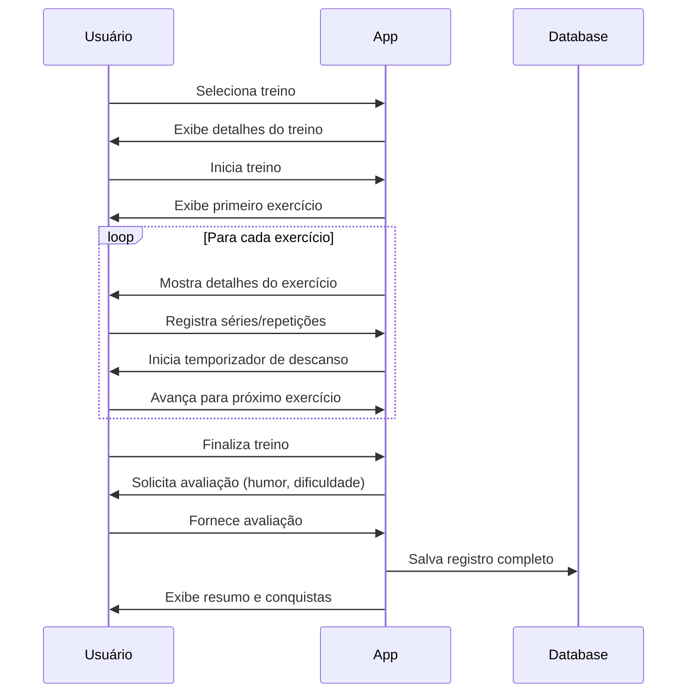
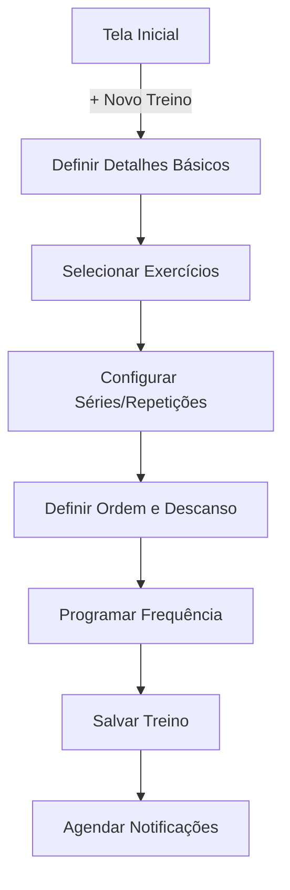
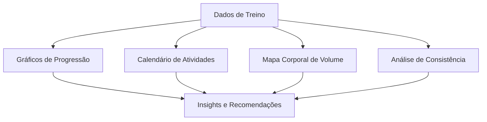

# Sistema de Treinos

## Visão Geral

O Sistema de Treinos do Osiris Rise permite que os usuários criem, gerenciem e acompanhem seus treinos físicos. Esta funcionalidade foi projetada para complementar a jornada de transformação pessoal, integrando-se com o sistema de hábitos e o contador de recaídas para uma abordagem holística de bem-estar.

## Funcionalidades Principais



## Interface do Usuário

### Tela Principal

A tela principal do sistema de treinos apresenta:

1. **Treinos Programados**: Próximos treinos agendados
2. **Histórico Recente**: Últimos treinos realizados
3. **Estatísticas Rápidas**: Resumo de atividades e progresso
4. **Biblioteca de Exercícios**: Acesso à biblioteca completa
5. **Botões de Ação**: Iniciar treino, criar novo, ver análises


### Fluxo de Treino



## Biblioteca de Exercícios

### Categorias

A biblioteca organiza os exercícios em categorias:

- **Grupos Musculares**: Peito, Costas, Pernas, Ombros, Braços, Abdômen, etc.
- **Tipo de Exercício**: Força, Cardio, Flexibilidade, Equilíbrio, etc.
- **Equipamento**: Peso Livre, Máquinas, Peso Corporal, Elásticos, etc.
- **Nível**: Iniciante, Intermediário, Avançado

### Detalhes do Exercício

Cada exercício inclui:

- Nome e descrição
- Instruções passo a passo
- Vídeo demonstrativo
- Músculos trabalhados (primários e secundários)
- Dicas de execução e segurança
- Variações e progressões

## Criação de Treinos

### Fluxo de Criação



1. Usuário inicia criação de novo treino
2. Define nome, objetivo e descrição
3. Seleciona exercícios da biblioteca
4. Configura séries, repetições ou duração
5. Define ordem dos exercícios e tempos de descanso
6. Programa frequência semanal
7. Salva e ativa o treino

### Templates Pré-definidos

O sistema oferece templates para diferentes objetivos:

- **Iniciante Total**: Treino completo para novatos
- **Hipertrofia**: Foco em ganho muscular
- **Perda de Peso**: Combinação de força e cardio
- **Força Máxima**: Foco em progressão de carga
- **Resistência**: Maior volume com cargas moderadas

## Registro e Acompanhamento

### Durante o Treino

O aplicativo auxilia durante a execução:

- **Temporizador**: Controle de tempo de descanso
- **Registro Fácil**: Interface otimizada para registro rápido
- **Histórico**: Acesso aos valores anteriores
- **Sugestões**: Recomendações de progressão
- **Modo Foco**: Minimiza distrações

### Após o Treino

Ao finalizar, o usuário pode registrar:

- **Avaliação de Esforço**: Escala de 1-10
- **Humor**: Como se sentiu durante e após
- **Notas**: Observações específicas
- **Fotos**: Registro visual opcional
- **Tempo Total**: Duração da sessão

## Análise de Progresso

### Métricas Acompanhadas

O sistema rastreia diversas métricas:

- **Volume Total**: Peso × Repetições × Séries
- **Carga Máxima**: Maior peso utilizado por exercício
- **Frequência**: Treinos por semana/mês
- **Consistência**: Aderência ao plano programado
- **Progressão**: Evolução das métricas ao longo do tempo

### Visualizações



- **Gráficos de Linha**: Evolução de carga e volume
- **Calendário de Calor**: Visualização de frequência
- **Mapa Corporal**: Volume por grupo muscular
- **Gráficos de Radar**: Equilíbrio do treinamento

## Implementação Técnica

### Modelo de Dados

```dart
// Modelo de Treino
class Workout {
  final String id;
  final String userId;
  final String name;
  final String description;
  final String objective;
  final List<WorkoutDay> days;
  final Map<int, bool> schedule; // Dias da semana
  
  // Métodos e lógica...
}

// Modelo de Dia de Treino
class WorkoutDay {
  final String id;
  final String name;
  final List<WorkoutExercise> exercises;
  
  // Métodos e lógica...
}

// Modelo de Exercício no Treino
class WorkoutExercise {
  final String id;
  final String exerciseId; // Referência à biblioteca
  final int order;
  final int sets;
  final int? repsPerSet;
  final double? weightPerSet;
  final int? durationSeconds;
  final int restSeconds;
  
  // Métodos e lógica...
}

// Modelo de Registro de Treino
class WorkoutLog {
  final String id;
  final String workoutId;
  final String userId;
  final DateTime date;
  final DateTime startTime;
  final DateTime endTime;
  final int durationMinutes;
  final int effortLevel;
  final String mood;
  final String notes;
  final List<ExerciseLog> exercises;
  
  // Métodos e lógica...
}

// Modelo de Registro de Exercício
class ExerciseLog {
  final String id;
  final String exerciseId;
  final List<SetLog> sets;
  
  // Métodos e lógica...
}

// Modelo de Registro de Série
class SetLog {
  final int setNumber;
  final int? reps;
  final double? weight;
  final int? durationSeconds;
  
  // Métodos e lógica...
}
```

### Algoritmo de Recomendação

O sistema utiliza os dados históricos para recomendar progressões:

```dart
// Exemplo simplificado de recomendação de progressão
Map<String, dynamic> recommendProgression(
    String exerciseId, List<ExerciseLog> history) {
  // Obter últimas 3 execuções do exercício
  final recentLogs = history
      .where((log) => log.exerciseId == exerciseId)
      .take(3)
      .toList();
  
  if (recentLogs.length < 3) {
    return {'type': 'maintain'}; // Dados insuficientes
  }
  
  // Verificar se usuário completou todas as séries e repetições
  bool completedAll = recentLogs.every((log) {
    return log.sets.every((set) => 
        set.reps != null && set.reps >= targetReps);
  });
  
  if (completedAll) {
    // Calcular média de peso atual
    double avgWeight = _calculateAverageWeight(recentLogs);
    
    // Recomendar aumento de 5-10%
    double increase = avgWeight * 0.075; // 7.5%
    
    return {
      'type': 'increase_weight',
      'current': avgWeight,
      'recommended': avgWeight + increase,
    };
  } else {
    return {'type': 'maintain'};
  }
}
```

## Integração com Outras Funcionalidades

### Hábitos e Rotinas

O sistema de treinos se integra com o sistema de hábitos:

- Treinos podem ser definidos como hábitos recorrentes
- Conclusão de treinos conta para sequências de hábitos
- Lembretes de treino seguem as preferências de notificação

### Contador de Recaídas

Conexão com o contador de recaídas:

- Treinos regulares podem reduzir chances de recaídas
- Análise de correlação entre atividade física e abstinência
- Recomendações de treino em momentos de risco

### Gamificação

Integração com o sistema de gamificação:

- Pontos e XP por treinos concluídos
- Conquistas específicas para metas de treino
- Evolução do avatar reflete desenvolvimento físico
- Desafios relacionados a treinos

## Personalização

Os usuários podem personalizar:

- **Preferências de Treino**: Foco, duração, frequência
- **Equipamento Disponível**: Filtrar exercícios por equipamento
- **Limitações Físicas**: Adaptar exercícios para necessidades específicas
- **Objetivos**: Definir metas de curto e longo prazo
- **Interface**: Métricas prioritárias e visualizações

## Próximos Passos

- [Sistema de Hábitos](habit-tracking.md) - Integre treinos com hábitos diários
- [Gamificação](gamification.md) - Veja como o sistema de recompensas funciona
- [Avatar](avatar-system.md) - Entenda como o avatar reflete seu progresso físico