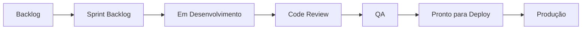
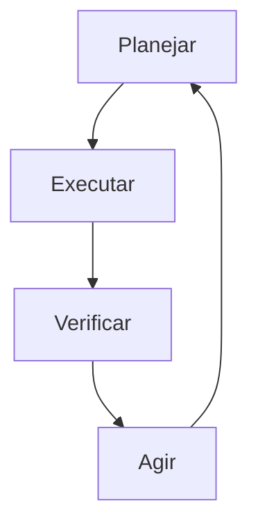

# 📊 Osiris Rise - Modelo 4Ps em Engenharia de Software

## 1. 👥 Pessoas (People)

### Equipe de Desenvolvimento
- **Desenvolvedor Frontend (2)**: Responsáveis pela implementação da interface do usuário, experiência do usuário e integração com APIs.
- **Desenvolvedor Backend (2)**: Responsáveis pela implementação da lógica de negócios, APIs e integração com banco de dados.
- **Designer UX/UI (1)**: Responsável pelo design visual, experiência do usuário e prototipagem.
- **QA Engineer (1)**: Responsável por testes manuais, automatizados e garantia de qualidade.
- **DevOps Engineer (1)**: Responsável pela infraestrutura, CI/CD, monitoramento e segurança.

### Stakeholders
- **Product Owner**: Representa os interesses do negócio e define prioridades do produto.
- **Scrum Master**: Facilita o processo Scrum e remove impedimentos da equipe.
- **Usuários Finais**: Pessoas em processo de recuperação de vícios que utilizarão o aplicativo.
- **Especialistas em Saúde Mental**: Consultores para aspectos psicológicos do aplicativo.
- **Especialistas em Fitness**: Consultores para aspectos de treinamento físico.

### Habilidades Necessárias
- Desenvolvimento Angular/React e Spring Boot
- Design responsivo e acessibilidade
- Experiência com gamificação
- Conhecimento em psicologia comportamental
- Experiência em desenvolvimento de aplicativos de saúde/fitness

### Cultura da Equipe
- Comunicação aberta e transparente
- Feedback contínuo
- Aprendizado constante
- Empatia com os usuários finais
- Compromisso com qualidade e segurança

## 2. 🔄 Processo (Process)

### Metodologia
- **Scrum**: Sprints de 2 semanas
- **Kanban**: Para visualização do fluxo de trabalho
- **DevOps**: Integração e entrega contínuas

### Cerimônias
- **Sprint Planning**: Planejamento das tarefas da sprint (2 horas)
- **Daily Standup**: Reunião diária de 15 minutos
- **Sprint Review**: Demonstração do trabalho concluído (1 hora)
- **Sprint Retrospective**: Reflexão sobre a sprint (1 hora)
- **Refinamento de Backlog**: Sessão semanal (1 hora)

### Fluxo de Trabalho

### Práticas de Engenharia
- **Controle de Versão**: Git com GitHub Flow
- **Code Review**: Revisão por pares obrigatória
- **TDD**: Desenvolvimento orientado a testes
- **CI/CD**: Pipeline automatizado para build, teste e deploy
- **Pair Programming**: Para tarefas complexas
- **Documentação**: Código, API e arquitetura

### Métricas
- Velocidade da equipe
- Lead time e cycle time
- Cobertura de testes
- Bugs por sprint
- Satisfação do usuário (NPS)

## 3. 📱 Produto (Product)

### Visão do Produto
Criar um aplicativo de transformação pessoal gamificado que ajude usuários a superar vícios, estabelecer hábitos saudáveis e acompanhar seu progresso físico e mental através de uma jornada inspirada na mitologia egípcia.

### Funcionalidades Principais
- **Sistema de Autenticação e Perfil**: Registro, login, perfil personalizável
- **Contador de Recaídas**: Rastreamento de dias consecutivos sem recaídas
- **Sistema de Gerenciamento de Treinos**: Criação e acompanhamento de treinos
- **Sistema de Hábitos**: Criação e acompanhamento de hábitos diários
- **Sistema de Metas e Objetivos**: Definição e acompanhamento de metas
- **Avatar Personalizável**: Representação visual do progresso do usuário
- **Sistema de Gamificação**: Pontos, níveis, medalhas e conquistas
- **Estatísticas e Análises**: Dashboard com métricas de progresso

### Requisitos Não-Funcionais
- **Desempenho**: Tempo de resposta < 2 segundos
- **Escalabilidade**: Suporte para até 100.000 usuários ativos
- **Disponibilidade**: 99.9% de uptime
- **Segurança**: Criptografia de dados sensíveis, autenticação segura
- **Usabilidade**: Interface intuitiva, acessível e responsiva
- **Privacidade**: Conformidade com LGPD/GDPR

### Arquitetura Técnica
- **Frontend**: Angular/React com Material Design
- **Backend**: Spring Boot com Java
- **Banco de Dados**: PostgreSQL
- **Cache**: Redis
- **Autenticação**: JWT
- **Infraestrutura**: AWS/Azure
- **Monitoramento**: Prometheus, Grafana

### Roadmap do Produto
- **MVP (3 meses)**: Autenticação, contador de recaídas, treinos básicos, hábitos básicos
- **V2 (6 meses)**: Gamificação completa, avatar personalizável, estatísticas avançadas
- **V3 (12 meses)**: Recursos sociais, integração com dispositivos, IA para recomendações

## 4. 🛠️ Projeto (Project)

### Cronograma
- **Fase de Planejamento**: 2 semanas
- **Desenvolvimento do MVP**: 12 semanas (6 sprints)
- **Beta Testing**: 2 semanas
- **Lançamento MVP**: Semana 16
- **Desenvolvimento V2**: 12 semanas
- **Desenvolvimento V3**: 24 semanas

### Orçamento
- **Recursos Humanos**: $25.000/mês
- **Infraestrutura**: $1.000/mês
- **Ferramentas e Licenças**: $500/mês
- **Marketing**: $5.000/lançamento
- **Contingência**: 15% do orçamento total

### Riscos e Mitigação
| Risco | Probabilidade | Impacto | Mitigação |
|-------|--------------|---------|-----------|
| Atraso no desenvolvimento | Média | Alto | Priorização rigorosa, MVP bem definido |
| Problemas técnicos | Média | Médio | Arquitetura bem planejada, testes abrangentes |
| Baixa adoção pelos usuários | Alta | Alto | UX focado no usuário, feedback contínuo |
| Problemas de segurança | Baixa | Alto | Revisões de segurança, testes de penetração |
| Rotatividade da equipe | Média | Médio | Documentação adequada, conhecimento compartilhado |

### Gestão de Qualidade
- **Testes Unitários**: Cobertura mínima de 80%
- **Testes de Integração**: Para todas as APIs
- **Testes E2E**: Para fluxos críticos
- **Testes de Usabilidade**: Com usuários reais
- **Revisões de Segurança**: Antes de cada release

### Comunicação
- **Interna**: Slack, reuniões diárias, documentação no Confluence
- **Stakeholders**: Relatórios semanais, demos quinzenais
- **Usuários**: Feedback in-app, pesquisas, beta testing

### Ferramentas
- **Gestão de Projeto**: Jira
- **Documentação**: Confluence
- **Comunicação**: Slack, Google Meet
- **Desenvolvimento**: GitHub, VS Code
- **CI/CD**: GitHub Actions, Docker
- **Monitoramento**: Prometheus, Grafana, Sentry

## 5. 📈 Integração dos 4Ps

### Alinhamento Estratégico
- **Pessoas + Processo**: Equipe multidisciplinar trabalhando em metodologia ágil
- **Processo + Produto**: Desenvolvimento iterativo focado em valor para o usuário
- **Produto + Projeto**: Roadmap alinhado com cronograma e orçamento
- **Projeto + Pessoas**: Recursos adequados para atingir os objetivos

### Fatores Críticos de Sucesso
- Equipe engajada e capacitada
- Processo ágil bem implementado
- Produto centrado no usuário
- Gestão de projeto eficiente
- Comunicação clara e transparente
- Foco na qualidade e segurança
- Feedback contínuo dos usuários

### Indicadores de Desempenho (KPIs)
- **Pessoas**: Satisfação da equipe, rotatividade
- **Processo**: Velocidade, lead time, qualidade do código
- **Produto**: NPS, retenção de usuários, engajamento
- **Projeto**: Aderência ao cronograma e orçamento, ROI

### Ciclo de Melhoria Contínua
